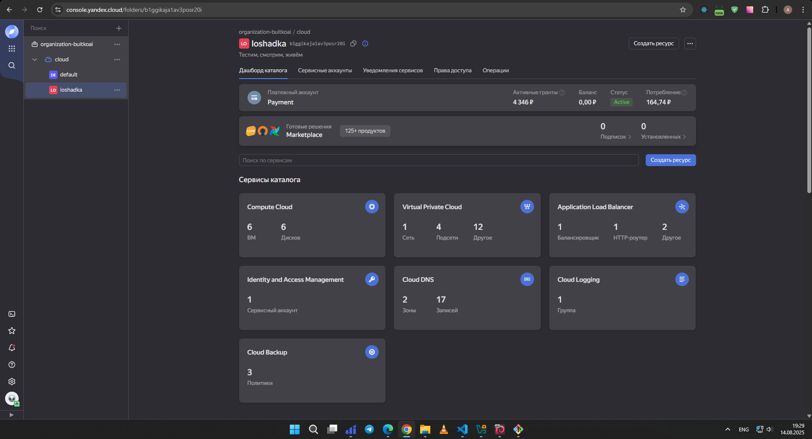

### Сайт

Создайте две ВМ в разных зонах, установите на них сервер nginx, если его там нет. ОС и содержимое ВМ должно быть идентичным, это будут наши веб-сервера.

Используйте набор статичных файлов для сайта. Можно переиспользовать сайт из домашнего задания.

Виртуальные машины не должны обладать внешним Ip-адресом, те находится во внутренней сети. Доступ к ВМ по ssh через бастион-сервер. Доступ к web-порту ВМ через балансировщик yandex cloud.
Задача
Ключевая задача — разработать отказоустойчивую инфраструктуру для сайта, включающую мониторинг, сбор логов и резервное копирование основных данных. Инфраструктура должна размещаться в Yandex Cloud и отвечать минимальным стандартам безопасности: запрещается выкладывать токен от облака в git. Используйте инструкцию.

Не используйте для ansible inventory ip-адреса! Вместо этого используйте fqdn имена виртуальных машин в зоне ".ru-central1.internal". Пример: example.ru-central1.internal - для этого достаточно при создании ВМ указать name=example, hostname=examle !!

# Сайт
Создайте две ВМ в разных зонах, установите на них сервер nginx, если его там нет. ОС и содержимое ВМ должно быть идентичным, это будут наши веб-сервера.

Используйте набор статичных файлов для сайта. Можно переиспользовать сайт из домашнего задания.

Виртуальные машины не должны обладать внешним Ip-адресом, те находится во внутренней сети. Доступ к ВМ по ssh через бастион-сервер. Доступ к web-порту ВМ через балансировщик yandex cloud.

Настройка балансировщика:

Создайте Target Group, включите в неё две созданных ВМ.

Создайте Backend Group, настройте backends на target group, ранее созданную. Настройте healthcheck на корень (/) и порт 80, протокол HTTP.

Создайте HTTP router. Путь укажите — /, backend group — созданную ранее.

Создайте Application load balancer для распределения трафика на веб-сервера, созданные ранее. Укажите HTTP router, созданный ранее, задайте listener тип auto, порт 80.

Протестируйте сайт curl -v <публичный IP балансера>:80

[invntry](./ansible/inventory/hosts.ini)

[terraform instance](./terraform/main.tf)

[terraform network](./terraform/network.tf)

[terraform groups](./terraform/security_groups.tf)

[terraform rules](./terraform/security_rules.tf)

Настройка балансировщика:

Создайте Target Group, включите в неё две созданных ВМ.

Создайте Backend Group, настройте backends на target group, ранее созданную. Настройте healthcheck на корень (/) и порт 80, протокол HTTP.

Создайте HTTP router. Путь укажите — /, backend group — созданную ранее.

Создайте Application load balancer для распределения трафика на веб-сервера, созданные ранее. Укажите HTTP router, созданный ранее, задайте listener тип auto, порт 80.

Протестируйте сайт curl -v <публичный IP балансера>:80

# Мониторинг
Создайте ВМ, разверните на ней Zabbix. На каждую ВМ установите Zabbix Agent, настройте агенты на отправление метрик в Zabbix.

Настройте дешборды с отображением метрик, минимальный набор — по принципу USE (Utilization, Saturation, Errors) для CPU, RAM, диски, сеть, http запросов к веб-серверам. Добавьте необходимые tresholds на соответствующие графики.

Логи
Cоздайте ВМ, разверните на ней Elasticsearch. Установите filebeat в ВМ к веб-серверам, настройте на отправку access.log, error.log nginx в Elasticsearch.

Создайте ВМ, разверните на ней Kibana, сконфигурируйте соединение с Elasticsearch.

[ansible zabbix server](./ansible/playbooks/zabbix.yml)

[ansible zabbix agent](./ansible/playbooks/zabbix_agent.yml)

[ansible kibana](./ansible/playbooks/kibana.yml)

[filebeat](./ansible/playbooks/filebeat.yml) (Руками)

# Сеть
Разверните один VPC. Сервера web, Elasticsearch поместите в приватные подсети. Сервера Zabbix, Kibana, application load balancer определите в публичную подсеть.

Настройте Security Groups соответствующих сервисов на входящий трафик только к нужным портам.

Настройте ВМ с публичным адресом, в которой будет открыт только один порт — ssh. Эта вм будет реализовывать концепцию bastion host . Синоним "bastion host" - "Jump host". Подключение ansible к серверам web и Elasticsearch через данный bastion host можно сделать с помощью ProxyCommand . Допускается установка и запуск ansible непосредственно на bastion host.(Этот вариант легче в настройке)

Исходящий доступ в интернет для ВМ внутреннего контура через NAT-шлюз.

[terraform network](./terraform/network.tf)

[terraform groups](./terraform/security_groups.tf)

[terraform rules](./terraform/security_rules.tf)

# Резервное копирование
Создайте snapshot дисков всех ВМ. Ограничьте время жизни snaphot в неделю. Сами snaphot настройте на ежедневное копирование.

